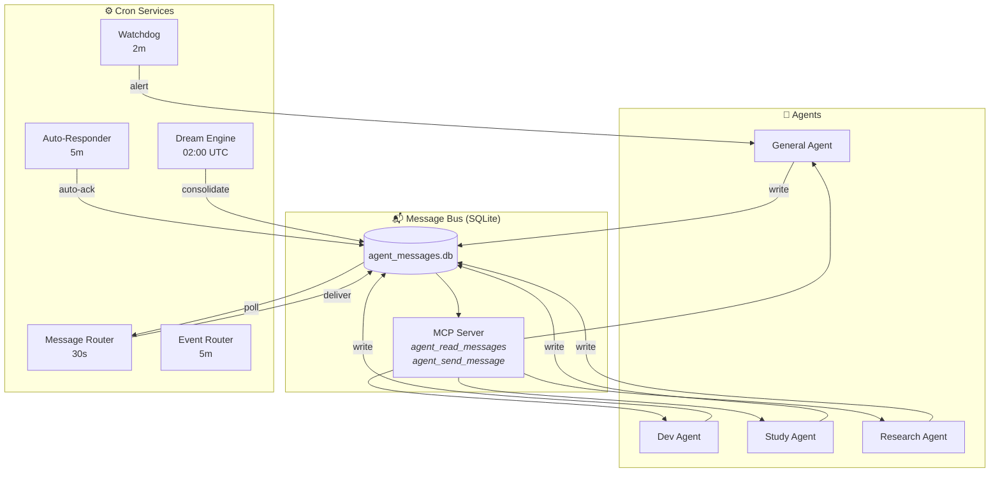

<picture>
  <source media="(prefers-color-scheme: dark)" srcset="media/amb-banner.svg">
  
</picture>

<br>

<div align="center">

[](LICENSE)
[]()
[]()
[]()
[]()

</div>

<div align="center">

[](https://pypi.org/project/a2a-communication-protocol/)

</div>

---

**Pull-based agent-to-agent communication bus for Hermes Agent profiles.**  
SQLite-backed, MCP-served, cron-orchestrated — with automatic loop protection, multi-agent LLM Bridge, and daily memory consolidation.

---

## 🎯 Overview

The Agent Message Bus enables **autonomous inter-agent collaboration** across Hermes Agent profiles. Every agent (General, Dev, Research, Study) communicates via a shared SQLite bus, with cron-based services handling delivery, auto-reply, watchdog alerts, and nightly consolidation.



## ✨ Features

| Feature | Description |
|---------|-------------|
| **Pull-based messaging** | Agents check their inbox at turn start — no push complexity |
| **Loop protection (3 layers)** | Type filter, chain depth (max 10), rate limit (3/60s) |
| **Auto-Responder** | Automatic acknowledgement + task delegation detection |
| **Watchdog** | Alerts on stale/unread messages (>60s) |
| **Dream Engine** | Nightly consolidation, skill extraction, memory maintenance |
| **Event Router** | Skill invocation recording + trigger chain processing |
| **MCP Tool Interface** | `agent_read_messages()`, `agent_send_message()`, `agent_mark_done()`, `agent_discover()` |
| **LLM Bridge** | Direct API auto-reply for delegate/request messages (bypasses MCP tool limits) |

## 🧩 Components

### 1. Core Package (`agent_message_bus/`)

| File | Purpose |
|------|---------|
| `__init__.py` | Core DB layer: `create_message()`, `get_pending_messages()`, `mark_done()`, migrations |
| `schemas.py` | Message types (delegate_task, request_data, status_update, etc.) with Pydantic models |
| `permissions.py` | Agent-specific access control |
| `notify_target.py` | Notification routing (Discord, Telegram, etc.) |
| `check_now.py` | On-demand message check trigger |

### 2. Bridge System (`bridges/`)

| Component | Description |
|-----------|-------------|
| `bridge_engine.py` | Shared logic: `should_auto_reply()`, `write_bridge_response()`, loop protection |
| `general_bridge.py` | General Agent auto-responder |
| `dev_bridge.py` | Dev Agent auto-responder |
| `research_bridge.py` | Research Agent auto-responder |
| `study_bridge.py` | Study Agent auto-responder |

### 3. Cron Services (`services/`)

| Service | Interval | Role |
|---------|----------|------|
| message_router | 30s | Deliver pending messages + write wakeup trigger files |
| auto_responder | 5m | Auto-acknowledge new messages + escalate tasks |
| watchdog | 2m | Monitor stale messages >60s, push alerts |
| event_router | 5m | Extract skills, process trigger chains |
| dream_engine | 02:00 UTC | Nightly consolidation: skill suggestions, memory health |
| mcp_server | Continuous | MCP tool server (`agent_read_messages`, etc.) |

## 🔄 Communication Flow

```
1. Agent A → create_message() → Bus (SQLite INSERT)
2. Message Router (30s) → deliver + wakeup trigger file
3. Auto-Responder (5m) → auto-ack (status: read)
4. Watchdog (2m) → alert if unread >60s
5. Target Agent → agent_read_messages() → process → agent_mark_done()
6. LLM Bridge (3m) → auto-generate LLM response if applicable
```

### Message Lifecycle

```
pending → delivered → read → done
                        ↓
                     failed
```

### Loop Protection

| Layer | Mechanism |
|-------|-----------|
| **Type filter** | `auto_reply` messages NEVER get responses |
| **Chain depth** | Max 10 nested responses |
| **Rate limit** | Max 3 responses / 60s / agent pair |
| **Blacklist** | `auto_responder`, `message-router` senders are excluded |

## 🚀 Installation

### pip install

```bash
pip install a2a-communication-protocol
```

### Or install from source

```bash
# 1. Copy the core package to your Hermes profile
cp -r agent_message_bus/ ~/.hermes/profiles/<profile>/scripts/agent_message_bus/

# 2. Copy bridge files
cp bridges/*.py ~/.hermes/profiles/<profile>/scripts/

# 3. Copy service files  
cp services/*.py ~/.hermes/profiles/<profile>/scripts/

# 4. Configure cron jobs (see docs/SETUP.md)
```

## 📊 Database

**Location:** `~/.hermes/data/agent_message_bus/agent_messages.db` (SQLite)

**Table:** `agent_messages`

| Field | Type | Description |
|-------|------|-------------|
| id | INTEGER PK | Auto-increment |
| from_agent | TEXT | Sender agent |
| to_agent | TEXT | Target agent |
| content | TEXT | JSON message payload |
| status | TEXT | pending/delivered/read/done/failed |
| priority | INTEGER | 0=normal, 1=high, 2=urgent |
| message_type | TEXT | delegate_task, request_data, etc. |
| chain_depth | INTEGER | Auto-reply nesting (max 10) |
| reply_to | INTEGER | Original message ID (if auto_reply) |
| is_auto_reply | INTEGER | 1 if LLM Bridge generated |
| created_at | REAL | Unix timestamp |

## 🔐 Security

- **Sender blacklist:** `auto_responder`, `message-router` — never trigger LLM responses
- **Permissions:** Agent-specific access control per `permissions.py`
- **Rate limiting:** Prevents runaway auto-reply chains
- **Circuit breaker:** Automatic isolation of failing agents

## 📚 Related

- [Hermes Agent](https://github.com/NousResearch/hermes-agent) — The agent framework this bus was built for
- [Google A2A Protocol](https://github.com/google/A2A) — External agent-to-agent protocol (complementary, different scope)
- [SCP (Session Context Pre-fill)](https://github.com/kriszmac4/scp) — Context continuity across Hermes sessions

## 📄 License

MIT — see [LICENSE](LICENSE) for details.

---

<div align="center">
  <sub>Built for <a href="https://github.com/NousResearch/hermes-agent">Hermes Agent</a> by <a href="https://github.com/kriszmac4">kriszmac4</a></sub>
</div>
